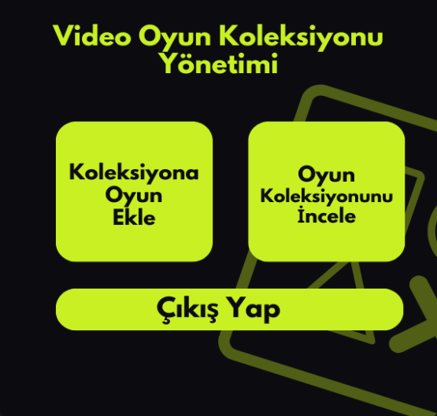
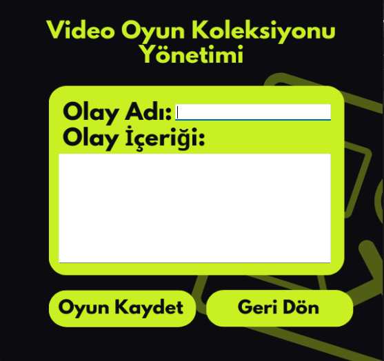

# 🎮 Video Oyun Koleksiyonu Sistemi

Bu proje, **C# Windows Forms** kullanılarak geliştirilmiş bir **Video Oyun Koleksiyonu Sistemi** uygulamasıdır. Kullanıcılar, sistem üzerinden sahip oldukları video oyunlarını listeleyebilir, oyun bilgilerini görüntüleyebilir ve yeni oyunlar ekleyebilir. Proje eğitim amaçlıdır.

## 🧩 Özellikler

- Video oyunlarını listeleme  
- Oyun detaylarını görüntüleme  
- Yeni oyun ekleme ve silme  
- Basit ve kullanıcı dostu arayüz  

## 🛠️ Kullanılan Teknolojiler

- C# (Windows Forms)  
- .NET Framework  
- Visual Studio  
- (Opsiyonel: JSON, XML ya da SQL Server ile veri saklama)  

## 🖼️ Uygulama İçi Ekran Görüntüleri

  
  
  

